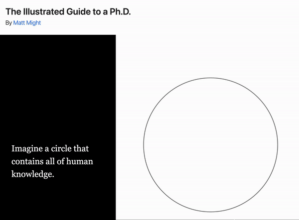

# README

## About

This is yet another tribute to <a href="https://matt.might.net/articles/phd-school-in-pictures/" target="_blank">The Illustrated Guide to a Ph.D.</a>, a beautifully distilled series of 12 illustrations and sentences created by <a href="http://matt.might.net/" target="_blank">Matt Might</a> to explain what a Ph.D. is all about.

This is also a small project to kick the tires on <a href="https://closeread.dev/" target="_blank">closeread</a>, a custom format for <a href="https://quarto.org/" target="_blank">Quarto</a> that enables __scrollytelling__ features for HTML documents.

The scrollytelling story is available at:

<a href="https://www.gastonsanchez.com/guide-to-phd" target="_blank">gastonsanchez.com/guide-to-phd</a>

## Acknowledgements

Special thanks to <a href="https://github.com/andrewpbray" target="_blank">Andrew Bray</a> (and co-developers) for introducing me to their amazing tool `closeread`.

